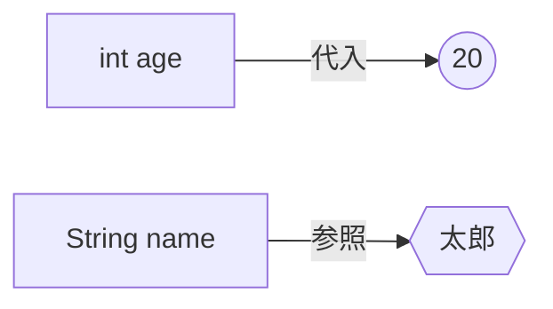

# Javaプログラミング講座
変数について学ぼう

---

# Javaの変数宣言

```java {1|2}
int age = 20;
System.out.println(age);
```
<div v-click>
    <div class="p-8 bg-blue-500 text-white rounded shadow-lg w-32 text-center">
      age: 20
    </div>
</div>

<div v-click class="p-8 bg-blue-500 text-white rounded shadow-lg w-32 text-center mx-auto mt-10 transition-all duration-1000">
  age: 20
</div>

---

# まとめ
- **変数は箱**のようなもの
- `int` は整数（数字）を入れるというルール
- `=` は「右のものを左に入れる」という意味

<button onclick="speechSynthesis.speak(new SpeechSynthesisUtterance('変数は、箱のようなものです。'))" class="bg-green-500 text-white px-4 py-2 rounded mt-8 cursor-pointer hover:bg-green-600">
  🔊 speak
</button>

---

# まとめ：標準モード（女性・速度1.0・ハイライトあり）
<KaraokeReader text="変数は、箱のようなものです。ここは標準の女性の声で読み上げられます。" />

---

# まとめ：男性の声・ゆっくり
<KaraokeReader text="ここは非常に重要なポイントです。ゆっくりとした男性の声で解説します。" gender="male" :speed="0.8" />

---

# まとめ：女性の声・早口
<KaraokeReader text="復習になりますが、右のものを左に入れるのがルールです。" :speed="1.5" />

---

# まとめ：読み上げのみ（ハイライト処理なし）
<KaraokeReader text="ハイライト処理を行わないため、スライドの読み込みが非常に高速になります。" audioOnly />

---

# まとめ（標準：少し若い女性の声・助詞スキップ）
<KaraokeReader text="変数は、箱のようなものです。右のものを左に入れるのがルールです。" />

---

# まとめ（さらに若く明るい声にしたい場合）
<KaraokeReader text="もっと高くて若い声にします。ピッチを1.5に設定しました。" :pitch="1.5" />

---

# まとめ（逆に落ち着いた低い声にしたい場合）
<KaraokeReader text="落ち着いた声にします。ピッチを0.8に下げました。" :pitch="0.8" />


---

# 変数と代入のイメージ（Mermaid図形）

